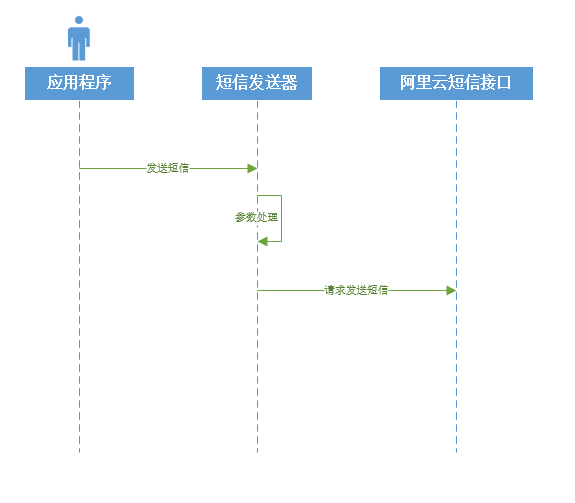

目前ADI平台短信模块只实现了基于阿里云短信API发送短信

发送短信用例序列图：

短信发送器类：
~~~
com.iciyun.adi.common.sms.SmsSender
~~~
在使用之前需要在阿里云注册AK以及开通短信服务，并设置短信签名与模块
详情请参考：[https://help.aliyun.com/document_detail/59210.html?spm=5176.doc55284.6.544.AOiZxw](https://help.aliyun.com/document_detail/59210.html?spm=5176.doc55284.6.544.AOiZxw)
applicaiton.yml:
~~~
adi:
  sms:
   aliyun:
     accessKeyId: <accessKeyId>
     accessKeySecret: <accessKeySecret>
~~~
配置了阿里云短信AK之后平台将自动装配短信发送模块
~~~
@Configuration
@EnableConfigurationProperties({AliyunSmsProperties.class})
public class SmsAutoConfiguration {
	
	@Autowired
	private AliyunSmsProperties aliyunSmsProperties;

	@Bean
	@ConditionalOnClass({AliyunSmsSender.class})
	@ConditionalOnProperty(prefix = "adi",value="sms.aliyun.accessKeyId")
	public SmsSender smsSender() {
		AliyunSmsSender sender = new AliyunSmsSender();
		BeanUtils.copyProperties(aliyunSmsProperties, sender);
		return sender;
	}
}

~~~
调用SmsSender.send方法发送短信：
示例：
~~~

@RunWith(SpringRunner.class)
@SpringBootTest(classes = SmsTestApplication.class)
public class SmsTest {

	@Autowired
	private SmsSender smsSender;
	
    @Test
    public void sendSmsTest() {
    	//填充变量
    	Map<String,Object> params = new HashMap<String,Object>();
    	params.put("code","123456");
    	SmsSendResult result = smsSender.send("SMS_115750106", "测试", Arrays.asList("15000000000"), params);
    	assertTrue(result.isSuccess());
    }
    
}

~~~

参数说明：

|  参数名  |  类型  |  含义  |  备注  |
| --- | --- | --- | --- |
|   templateCode | String   |  阿里云短信模块Code  |    |
|   signName | Stiring  |  阿里云短信签名  |    |
|  phoneNumbers  | List<String>   | 接收手机号列表   |  如果是验证码短信请不要批量发送  |
|  params  | Map<String,Object>   | 变量参数   |  用于替换短信模板中的参数  |

